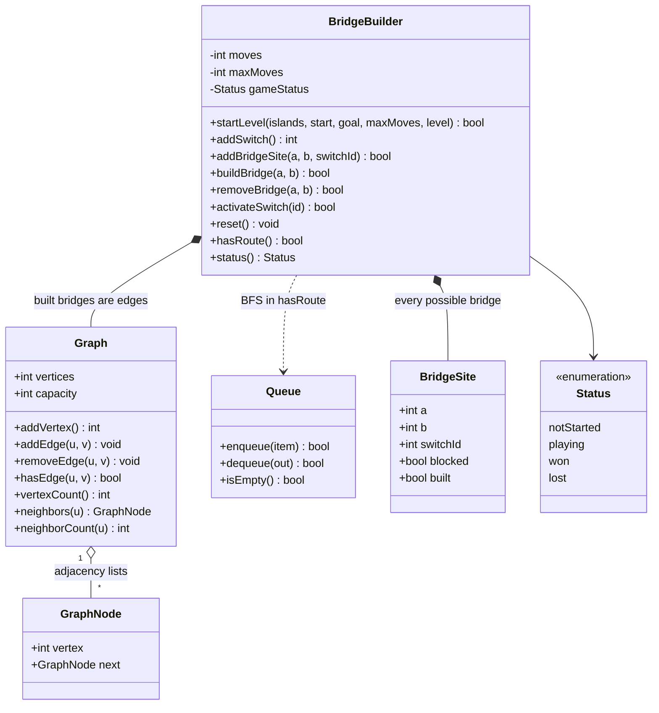

# Class Diagram: Graph and Bridge Builder

```mermaid
classDiagram
    class GraphNode {
        +int vertex
        +GraphNode next
    }
    class Graph {
        +int vertices
        +int capacity
        +addVertex() int
        +addEdge(u, v) void
        +removeEdge(u, v) void
        +hasEdge(u, v) bool
        +vertexCount() int
        +neighbors(u) GraphNode
        +neighborCount(u) int
    }
    class Queue {
        +enqueue(item) bool
        +dequeue(out) bool
        +isEmpty() bool
    }
    class BridgeSite {
        +int a
        +int b
        +int switchId
        +bool blocked
        +bool built
    }
    class BridgeBuilder {
        -int moves
        -int maxMoves
        -Status gameStatus
        +startLevel(islands, start, goal, maxMoves, level) bool
        +addSwitch() int
        +addBridgeSite(a, b, switchId) bool
        +buildBridge(a, b) bool
        +removeBridge(a, b) bool
        +activateSwitch(id) bool
        +reset() void
        +hasRoute() bool
        +status() Status
    }
    class Status {
        <<enumeration>>
        notStarted
        playing
        won
        lost
    }

    Graph "1" o-- "*" GraphNode : adjacency lists
    BridgeBuilder *-- Graph : built bridges are edges
    BridgeBuilder *-- BridgeSite : every possible bridge
    BridgeBuilder ..> Queue : BFS in hasRoute
    BridgeBuilder --> Status
```